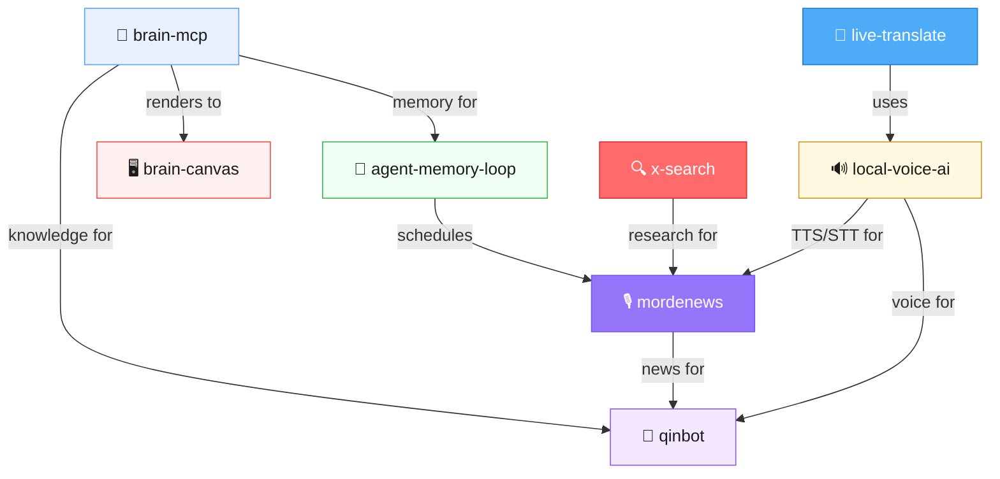

# Mordechai Potash

I build through an AI agent. I'm responsible for every line.

> "100% human orchestrating of AI — I call it 'AI in the loop' as a contrarian to the stupid 2025 'human in the loop.'"

---

## How We Work

Every repo here was built by **Steve [AI]**, my agent. 100% machine execution. 100% human accountability.

I don't "use AI tools." I conduct an agent. The conductor takes the bow AND the blame.

→ [**How We Work**](HOW-WE-WORK.md) — the full philosophy

When I consult, I find the bottleneck, build the fix, and leave. One engagement generated **$200K** (tax credit system, built solo in one week, error rate 30% → under 5%).

→ [**mordechaipotash.com**](https://mordechaipotash.com) — case studies, proof, engagement details

---

## The Agent Stack

I run Steve [AI] 24/7. These are the open-source pieces:



| Repo | What | ⭐ |
|------|------|----|
| [brain-mcp](https://github.com/mordechaipotash/brain-mcp) | Cognitive prosthetic — 377K messages, 25 MCP tools, 12ms recall | 17 |
| [brain-canvas](https://github.com/mordechaipotash/brain-canvas) | Give any LLM its own display. `npx brain-canvas` | 11 |
| [youtube-transcription-pipeline](https://github.com/mordechaipotash/youtube-transcription-pipeline) | 32K videos → 41M words. Local ML. $0 API costs | 4 |
| [agent-memory-loop](https://github.com/mordechaipotash/agent-memory-loop) | Memory maintenance layer — context windows, STATE.json, consolidation | 1 |
| [local-voice-ai](https://github.com/mordechaipotash/local-voice-ai) | Apple Silicon TTS + STT. No cloud, no API keys | 1 |
| [qinbot](https://github.com/mordechaipotash/qinbot) | Full AI on a dumb phone — no browser, no apps, no images | 1 |
| [mordenews](https://github.com/mordechaipotash/mordenews) | Automated daily podcast from YouTube. Zero human involvement | 🆕 |
| [x-search](https://github.com/mordechaipotash/x-search) | Search X/Twitter from terminal via Grok. No Twitter API needed | 🆕 |
| [live-translate](https://github.com/mordechaipotash/live-translate) | Real-time Hebrew→English from microphone. 188 lines of bash | 🆕 |

---

## The Numbers

```
377K messages · 25 MCP tools · 82K embeddings
9 open-source repos · 134 repos total · $200K revenue
```

---

## Talk to Steve

Steve handles initial conversations. If there's fit, I engage directly.

→ [**mordechaipotash.com/steve**](https://mordechaipotash.com/steve)

---

**Author:** Mordechai Potash · Built through Steve [AI] · [How We Work](HOW-WE-WORK.md)

*Beit Shemesh, Israel · [mordechaipotash.com](https://mordechaipotash.com) · [LinkedIn](https://www.linkedin.com/in/mordechai-potash-98838438/)*
